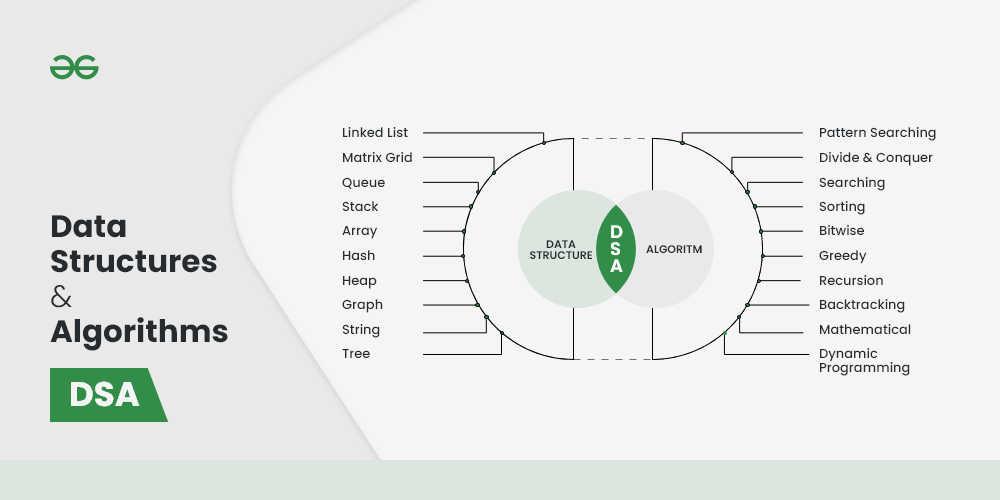

# Data Structures and Algorithms Programs in CPP

Source of Image File : [GFG](https://geeksforgeeks.org/)

Welcome to the Data Structures and Algorithms Programs repository! This repository contains a collection of programs and implementations related to various data structures and algorithms. Whether you're a beginner looking to learn the fundamentals or an experienced programmer aiming to refresh your knowledge, this repository has something for you.

## Table of Contents

- [Introduction](#introduction)
- [Program Categories](#program-categories)
- [Getting Started](#getting-started)
  - [Prerequisites](#prerequisites)
  - [Usage](#usage)
- [Contributing](#contributing)

## Introduction

Understanding data structures and algorithms is crucial for writing efficient and optimized code. This repository aims to provide clear and well-documented implementations of various data structures and algorithms, accompanied by explanations where necessary. You can use these programs as educational resources, reference materials, or building blocks for your own projects.

## Program Categories

The repository covers a wide range of topics, including but not limited to:

- Arrays
- String
- Linked Lists
- Stacks and Queues
- Binary Search
- Sorting and Searching Algorithms
- Dynamic Programming
- And more...

## Getting Started

### Prerequisites

To make the most of this repository, you should have a basic understanding of programming concepts and the programming language in which the programs are written (such as Python, Java, C++, etc.).

### Usage

1. Browse the repository to find the specific data structure or algorithm you're interested in.
2. Open the corresponding program file to view the implementation and accompanying comments.
3. Experiment with the code, modify it, and use it in your projects.

## Contributing

Contributions are encouraged! If you have improvements, optimizations, or new implementations to contribute, please follow these steps:

1. Fork the repository.
2. Create a new branch for your contribution.
3. Make your changes and additions.
4. Write clear commit messages.
5. Submit a pull request explaining your changes.

Please ensure your code follows best practices and includes relevant comments and documentation.

---

Maintained with ❤️ by Sumit Raghukant Soni. Happy coding!
